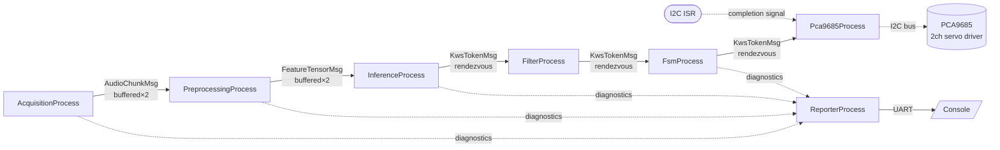
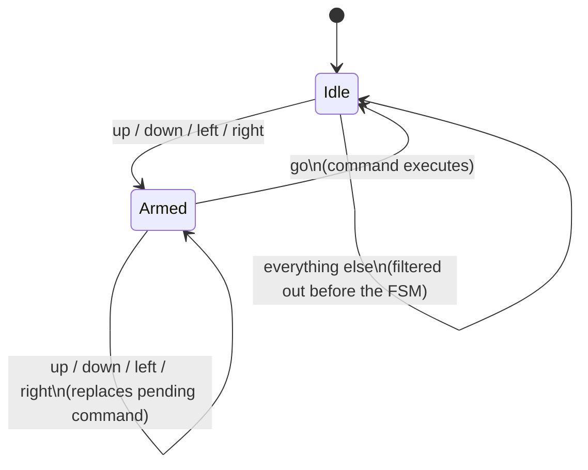

# CSP4CMSIS-based Keyword Spotting with Hardware Actuation

Keyword Spotting (KWS) detects specific spoken words within a continuous audio stream, typically in low-power, always-on settings. This app uses ARM's [Keyword Transformer](https://www.isca-archive.org/interspeech_2021/berg21_interspeech.pdf) model to run KWS on the Himax WE2 (Cortex-M55 + Ethos-U55 NPU), and goes one step further than plain classification: recognized voice commands drive two channels of a **PCA9685 16-channel, 12-bit PWM I2C servo driver** — say a direction, confirm it, and watch a servo step one position.

Audio preprocessing follows ARM's [ml-embedded-evaluation-kit](https://review.mlplatform.org/plugins/gitiles/ml/ethos-u/ml-embedded-evaluation-kit/+/refs/tags/22.02/docs/use_cases/kws.md) approach: raw audio → MFCC features → NPU inference.

---

## 🚀 Concurrency with CSP4CMSIS

The app is a **seven-process CSP network** built with [CSP4CMSIS](https://oliverfaust.github.io/CSP4CMSIS/)'s Communicating Sequential Processes model (CSP4CMSIS 2.0.1) on top of FreeRTOS 10.5.1, through the SDK's CMSIS-RTOS2 adapter (`OS_HAL := y`; the kernel is started with `osKernelInitialize()`/`osKernelStart()`). Each process is an independent, statically-allocated thread communicating exclusively through typed channels — no shared mutable state, no manual locking. Six of the seven form the active audio-to-actuation pipeline; the seventh (`ReporterProcess`) is a diagnostic sink that sits off to the side so console I/O can never stall the pipeline.

| Process | Responsibility |
|---|---|
| **AcquisitionProcess** | Owns the PDM/DMA ring buffer; hands off each freshly-completed audio segment as soon as it's safe to read (one slot behind the DMA's actively-writing index). |
| **PreprocessingProcess** | Maintains a persistent, incrementally-updated MFCC feature tensor, shifting in new frames each cycle, double-buffered against Inference. |
| **InferenceProcess** | Copies the completed tensor into the model's input, runs the Ethos-U55 NPU via `Invoke()`, and classifies the result. |
| **FilterProcess** | Restricts the stream to the command vocabulary (`up`, `down`, `left`, `right`, `go`) — everything else (`_silence_`, `_unknown_`, `yes`, `no`, `on`, `off`, `stop`) is dropped here — and collapses consecutive duplicate labels, so a held-down keyword doesn't flood the FSM with repeats. |
| **FsmProcess** | Interprets the filtered keyword stream as two-word commands (`<direction> go`) and drives the hardware channel — see [Voice Command Interaction](#-voice-command-interaction) below. |
| **Pca9685Process** | Owns the I2C bus; translates a confirmed FSM command into a PWM pulse-width update on one of two PCA9685 servo channels. |
| **ReporterProcess** | Owns all UART/console output via a lossy, non-blocking channel, so a burst of print activity can never propagate backpressure into the acquisition/inference path. |

### Process Network Diagram



`AcquisitionProcess → PreprocessingProcess` and `PreprocessingProcess → InferenceProcess` are **depth-2 buffered channels**, giving a little slack for pipelining. `InferenceProcess → FilterProcess → FsmProcess → Pca9685Process` are **zero-capacity rendezvous channels** — each stage blocks until the next is ready, so a downstream stall (e.g. a slow I2C write) correctly back-pressures all the way to Acquisition rather than silently dropping data. All diagnostic/status output funnels into `ReporterProcess` through a **lossy, buffered channel** (`SamplingBufferedChannel`, keep-newest policy), which is intentionally the *only* lossy link in the network.

### Task Priorities

Priorities are CMSIS-RTOS2 `osPriority_t` values; they keep the order of the pre-2.0 FreeRTOS priorities `tskIDLE_PRIORITY + 0..4`, mapped to `osPriorityLow..osPriorityLow4` (with the adapter, `configMAX_PRIORITIES` is 56, so all of them are in range). Priorities decrease monotonically along the data-flow direction, and the task that constructs the network (`MainApp_Task`) is created at a priority **at or above** every child's, so none of them can preempt it mid-construction:

| Task | Priority |
|---|---|
| `MainApp_Task` (network construction) | `osPriorityLow4` (was `+4`) |
| `AcquisitionProcess` | `osPriorityLow4` (was `+4`) |
| `PreprocessingProcess` | `osPriorityLow3` (was `+3`) |
| `InferenceProcess` | `osPriorityLow2` (was `+2`) |
| `FilterProcess` / `FsmProcess` | `osPriorityLow1` (was `+1`) |
| `ReporterProcess` / `Pca9685Process` | `osPriorityLow` (was `+0`) |

---

## 🎮 Voice Command Interaction

Commands are spoken as **two words**: a direction, then `"go"` to confirm it. This two-step pattern exists specifically to avoid a stray, low-confidence classification accidentally firing an output — a single misheard word can never trigger hardware on its own.



**Example interaction:**

> *"left"* → FSM arms, remembers `left`, no output yet
> *"go"* → FSM confirms, sends `left` to the hardware controller, prints `[FSM] Executing Command Console Output: left`, channel 1's servo steps from `Middle` to `Half Left`, log shows `[PCA9685] Ch1 <- 'left' -> position 1/4 (Half Left)`

If you change your mind mid-sequence, just say a new direction — it silently replaces the pending one without needing to abort first:

> *"up"* → armed with `up`
> *"down"* → still armed, now with `down` (no abort message)
> *"go"* → executes `down`

> **Note on aborting:** `FsmProcess` still contains an `else` branch that aborts an armed sequence (`[FSM] Sequence aborted! Returning to Idle.`) on receiving anything that isn't a direction or `go`. That branch is currently **unreachable** in practice: `FilterProcess` now only ever forwards `up`, `down`, `left`, `right`, and `go` (see [Recognized Vocabulary](#recognized-vocabulary) below), so words like `yes`/`no`/`stop` never make it past the filter to trigger it. An armed command with no matching `go` will simply wait indefinitely rather than being cancelled by an off-vocabulary word. If you want that abort-on-irrelevant-word behavior back, the vocabulary words would need to pass through `FilterProcess` and instead be screened out only while the FSM is `Idle`.

### Command → Hardware Mapping

Two PCA9685 channels are driven, each holding one of **5 discrete positions**. `up`/`down` step channel 0; `left`/`right` step channel 1. Both channels initialize to `Middle` at startup, and stepping past either end simply holds at the limit (logged as `[at limit]`) rather than wrapping.

| Position index | Name | Pulse width | Reached by |
|---|---|---|---|
| 0 | Max Left | 1000 µs | repeated `up` (ch0) / `left` (ch1) |
| 1 | Half Left | 1250 µs | |
| 2 | Middle *(startup default)* | 1500 µs | |
| 3 | Half Right | 1750 µs | |
| 4 | Full Right | 2000 µs | repeated `down` (ch0) / `right` (ch1) |

| Spoken command | Channel | Step direction |
|---|---|---|
| `up` | 0 | one position towards Max Left |
| `down` | 0 | one position towards Full Right |
| `left` | 1 | one position towards Max Left |
| `right` | 1 | one position towards Full Right |

`yes`, `no`, `on`, `off`, and `stop` are recognized by the model but are dropped in `FilterProcess` before they can reach the FSM or the hardware — they currently have no effect at all.

### Recognized Vocabulary

The model classifies 12 labels: `_silence_`, `_unknown_`, `yes`, `no`, `up`, `down`, `left`, `right`, `on`, `off`, `stop`, `go`. A classification is only reported at all if its confidence is **≥ 70%**.

Of those 12, only `up`, `down`, `left`, `right`, and `go` survive `FilterProcess` — everything else, including `_unknown_`, `_silence_`, and the five non-command words, is silently dropped at that stage and never seen by `FsmProcess`, `Pca9685Process`, or the console's `[FSM]`/`[PCA9685]` logging.

---

## 🔧 Key Code Snippets

### Safe buffer selection (`csp4cmsis_spn.cpp`)
The DMA ISR increments `w_buf_idx` and immediately starts filling that new slot — so the buffer that's actually safe to read is always one slot *behind* the live index, not the live index itself:
```cpp
// DMA ISR: w_buf_idx++ then immediately re-arms DMA into audio_buf[w_buf_idx]
int32_t current_buf = (observedWBufIdx + NUM_BUFF - 1) % NUM_BUFF;
```

### Command vocabulary allow-list (`csp4cmsis_spn.cpp`)
```cpp
static bool isAllowed(const char *label) {
    static const char *const kAllowed[] = { "up", "down", "left", "right", "go" };
    for (const char *allowed : kAllowed) {
        if (std::strcmp(label, allowed) == 0) return true;
    }
    return false;
}
// ...
if (!isAllowed(msg.label)) {
    continue; // drop _silence_, _unknown_, yes, no, on, off, stop
}
```

### FSM two-word confirmation (`csp4cmsis_spn.cpp`)
```cpp
if (state == State::Idle) {
    if (isDirection(msg.label)) { savedCommand = msg.label; state = State::Go; }
} else if (state == State::Go) {
    if (msg.label == "go") {
        out_hw << KwsTokenMsg{savedCommand};   // execute
        state = State::Idle;
    } else if (isDirection(msg.label)) {
        savedCommand = msg.label;              // replace pending command
    } else {
        out_report << FsmAbort{};              // cancel (unreachable given current FilterProcess)
        state = State::Idle;
    }
}
```

### PCA9685 servo update with ISR-driven completion (`csp4cmsis_spn.cpp`)
```cpp
void set_pwm(uint8_t channel, uint16_t on, uint16_t off) {
    uint8_t buf[5];
    buf[0] = LED0_ON_L + 4 * channel;   // auto-increment writes ON_L/H, OFF_L/H in one go
    buf[1] = on & 0xFF;  buf[2] = on >> 8;
    buf[3] = off & 0xFF; buf[4] = off >> 8;
    hx_drv_i2cm_interrupt_write(USE_DW_IIC_0, slave_addr, buf, sizeof(buf), (void *)pca9685_i2c_callback);
    i2c_sync >> dummy;   // blocks until the I2C ISR fires pca9685_i2c_callback()
}
```

The completion callback runs in the I2C interrupt. It writes `true` to a one-slot `BufferedChannel<bool, 1>` through `isrWriter().putFromISR()` (an interrupt cannot wait for a rendezvous partner, and the slot keeps a completion that arrives before the process waits). The process starts one transfer at a time, so a failed write means a second completion before the first was read (a driver bug): the callback then prints `FATAL: I2C completion lost ...` and halts.

**Interrupt priorities:** every interrupt whose handler calls CSP4CMSIS or FreeRTOS must run at priority 5..7 (`CSP4CMSIS_MAX_SYSCALL_INTERRUPT_PRIORITY` = 5, 3 priority bits); the SDK leaves them at 0. The app sets `I2C_MST_0_intr_IRQn` (I2C completion) and `DMAC2_DMACINTR_IRQn` (PDM audio DMA; its callback reads the RTOS tick) to 5 in the app's `.c` file before the drivers start, and `U55_IRQn` (NPU; gives the Ethos-U semaphore) in `cvapp_kws.cpp` before it is enabled.

**Ethos-U semaphore:** `ethosu_rtos_semaphore.c` overrides the driver's weak bare-metal semaphore with a FreeRTOS binary semaphore, so `Invoke()` blocks the inference thread instead of spinning. It stays native FreeRTOS on purpose (a driver hook) and is the only object in the FreeRTOS heap (`configTOTAL_HEAP_SIZE` 1 KB; C++ allocations use the C library heap, `__HEAP_SIZE` 44 KB in the `.ld`).

---

## Sample Console Output

```text
--- KWS Pipeline starting (incl. PCA9685 I2C servo control) ---
Preprocessing state initialised: tensor_bytes=3920 type=9
Preprocessing: priming step [PCA9685] Initializing PWM driver, centering both servos...
1/1 (window not yet fully real)
[PCA9685] Ch0 (up/down) -> Middle | Ch1 (left/right) -> Middle
Label: left Score: 90 % Label Index: 6
Label: go Score: 84 % Label Index: 11
[FSM] Executing Command Console Output: left
[PCA9685] Ch1 <- 'left' -> position 1/4 (Half Left)
[Acq]  Missed 0/20 | ms: dma_wait=9682 buf_asm=0 chan_send_wait=0 | elapsed=9684ms rtf=1.03
[DMA]  cb_count=19 avg_interval=512ms (ground truth, ISR-measured)
[Mem]  free_heap=219248 min_ever_free=185040 | stack_hwm(words): prep=0 infer=0
[Prep] Processed 20 | ms: mfcc=139 chan_send_wait=0 | elapsed=9691ms rtf=1.03
[Inf]  Processed 20 | ms: copy=0 invoke=4800 post=0 | elapsed=10436ms rtf=0.95
[Sem]  take=980 give=1960
```

---

## 📁 File Structure

```text
app/scenario_app/csp4cmsis_kws_iic/
├── csp4cmsis_kws_iic.c     // PDM/DMA driver glue, ring-buffer ISR callback
├── csp4cmsis_kws_iic.h     // Ring-buffer sizing (BLK_NUM, NUM_BUFF, AUDIO_LEN)
├── cvapp_kws.cpp           // Model init, MFCC, Invoke(), label table
├── cvapp_kws.h             // cv_kws_* API, timing globals
├── csp4cmsis_spn.cpp       // The 7 CSP processes + network construction
├── csp4cmsis_spn.h         // Reporting API shared across processes
└── ethosu_rtos_semaphore.c // FreeRTOS-backed semaphore for the Ethos-U55 IRQ
```

## 🧪 Test status (CSP4CMSIS 2.0.1)
Tested on the Grove Vision AI V2 with the on-board microphone: start-up, the audio path, MFCC, inference and reporting match the pre-2.0 build. The I2C part (Pca9685Process) is migrated but **not tested with a PCA9685 attached**: without the device the driver completes each (unacknowledged) transfer, so the actuator process starts and runs, but no output can be observed.

## 🐛 Troubleshooting
* **`std::bad_alloc` right after the pipeline banner** — the C library heap is too small. Since CSP4CMSIS 2.0, C++ `new` uses the C library heap (`__HEAP_SIZE` in the `.ld`, 44 KB; about 35 KB in use); before, the library routed it to the FreeRTOS heap.
* **`FATAL: I2C completion lost`** — a second I2C completion arrived before the actuator process had read the first one; the transfer protocol (one transfer, then wait) rules this out, so it points at the driver.

* **Everything goes silent, immediately, right after thread creation** — a `taskPriority()` override (or `MAIN_APP_PRIORITY`) is outside the CMSIS-RTOS2 range; use the named `osPriority_t` values (`osPriorityLow`..`osPriorityLow4` here). The library then prints `FATAL ERROR: Failed to create RTOS2 task for CSProcess '...' (osThreadNew returned NULL ...)`.
* **All processes go silent together after running fine for a while, with no crash output** — a downstream stage is blocked forever on an un-timed-out wait, and its unbuffered channel is back-pressuring the whole chain. `Pca9685Process::wait_for_i2c_isr()` has no timeout and no I2C error callback; a single bus NACK or glitch leaves it blocked indefinitely, which then blocks `FsmProcess` → `FilterProcess` → `InferenceProcess` → the buffered channels behind them, in that order. Add a bounded wait and an error path to any ISR-driven completion signal on the critical path. (Measured with CSP4CMSIS 2.0.1 on a board without an I2C device: the Himax driver still calls the completion callback for an unacknowledged transfer, so a missing device alone does not block.)
* **A process never runs at a priority higher than the thread that constructs the network** — `Run(InParallel(...))` creates the child threads one at a time from the calling thread; a child priority *strictly greater* than the constructor's own priority preempts it immediately. Keep `MAIN_APP_PRIORITY` (`osPriorityLow4`) ≥ every child's.
* **Reporter process never prints anything, but the app doesn't crash** — priority/stack starvation of a low-priority process. Use `SleepFor(1)`, not a yield (which only rotates same-priority threads), in any polling loop on a higher-priority process.
* **Timing measurements wrap to a huge (~4 billion) value** — a raw `SysTick`-based cycle counter was used across a genuine RTOS blocking wait. Use `osKernelGetTickCount()` and `ticksToMs()` (in `cvapp_kws.h`) for any measurement spanning a blocking call.
* **Classification results look wrong / model seems to be fed stale audio** — check that `BLK_NUM` (in `csp4cmsis_kws_iic.h`) and `current_buf`'s one-slot-behind offset agree on which buffer the DMA has actually finished writing.
* **Commands log correctly but the servo never physically moves** — this is almost always a power/wiring issue, not a firmware one, since the log only confirms the I2C write completed successfully:
  * **Servo power (V+ rail)**: the PCA9685's V+ screw terminal (servo power, typically 5–6V) is separate from its logic-side VCC and is *not* powered by the WE2's I2C lines. No V+ supply connected means no servo movement even with perfectly good I2C traffic.
  * **Common ground**: the servo supply's ground must be tied to the WE2/PCA9685 ground.
  * **OE pin**: confirm the board's active-low output-enable pin is grounded, not floating.
  * **I2C address**: the code assumes `0x40` (all address pads open); a bridged A0–A5 pad changes the effective address and every write would silently NACK.
* **Build fails or asserts inside `fully_connected_common.cc`** — this app compiles with `-DCSP4CMSIS_KWS_IIC`. Extend the existing symmetric-quantization guard in `library/inference/<tflm_tag>/tensorflow/lite/micro/kernels/fully_connected_common.cc` to include it:
    ```cpp
     #if ((defined(KWS_PDM_RECORD) || defined(CSP4CMSIS_KWS_PDM_RECORD)) || defined(CSP4CMSIS_KWS_IIC)) || defined(CSP4CMSIS_KWS_PCA9685)
    #else
      TFLITE_DCHECK(filter->params.zero_point == 0);
    #endif
    ```

## Building and Running on WE2

1. Apply the `fully_connected_common.cc` patch above.
2. Set `APP_TYPE = csp4cmsis_kws_iic` in the [Makefile](https://github.com/HimaxWiseEyePlus/Seeed_Grove_Vision_AI_Module_V2/blob/main/EPII_CM55M_APP_S/makefile).
3. Build the firmware per [Building the Firmware in a Linux Environment](https://github.com/HimaxWiseEyePlus/Seeed_Grove_Vision_AI_Module_V2?tab=readme-ov-file#build-the-firmware-at-linux-environment).
4. Flash it (see [Flashing Image Updates](https://github.com/HimaxWiseEyePlus/Seeed_Grove_Vision_AI_Module_V2?tab=readme-ov-file#flash-image-update-at-linux-environment-by-python-code)):
    ```bash
    python3 xmodem/xmodem_send.py --port=/dev/ttyACM0 --baudrate=921600 --protocol=xmodem --file=we2_image_gen_local/output_case1_sec_wlcsp/output.img --model="model_zoo/kws_pdm_record/kwt1_relu_mfcc_fvp_aligned_vela.tflite 0xB7B000 0x00000"
    ```
5. Wire a PCA9685 to the WE2's I2C0 bus (default address `0x40`; leave A0–A5 address pads unbridged). Plug one servo into **channel 0** (up/down) and a second into **channel 1** (left/right). The PCA9685's servo-power rail (V+ screw terminal) needs its own 5–6V external supply — the WE2's I2C lines don't power it — and that supply's ground must be tied to the PCA9685/WE2 ground.
6. Press `reset` and try saying a direction followed by `"go"`.

## 📝 License
This example is provided under the standard Himax SDK license terms. Refer to the top-level license file in the SDK for details.
